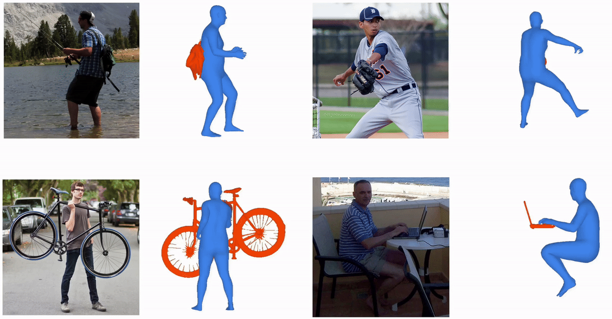

# MILO: Reconstructing Humans and Objects in Interaction using Large Reconstruction Models

Official implementation of **"Reconstructing Humans and Objects in Interaction using Large Reconstruction Models"** (ECCV 2026).

<p align="center">
  <a href="https://ac5113.github.io/MILO"></a>
  <a href="https://arxiv.org/abs/XXXX.XXXXX"></a>
  <a href="https://ac5113.github.io/MILO/static/milo.pdf"></a>
</p>

<p align="center">
  
</p>

> ⚠️ **Placeholder links.** The project page / arXiv / paper URLs above will be updated upon release.

---

## Overview

MILO reconstructs detailed 3D human–object interactions (HOI) from a single RGB image. The key idea is to use a Large Reconstruction Model - [Hunyuan3D-2.0](https://github.com/Tencent-Hunyuan/Hunyuan3D-2) by default, or [SAM 3D Objects](https://github.com/facebookresearch/sam-3d-objects) with `--lrm sam3d` - as a geometric scaffold that jointly reconstructs the person and the object, preserving their relative arrangement. Instead of relying on reprojection objectives or ground-truth contact, MILO *interprets* the LRM mesh:

1. Generate a combined human–object mesh with the LRM.
2. Segment it into human and object components.
3. Fit a parametric SMPL-H body to the human part (via triangulated 3D keypoints).
4. Optionally align an object template to the object part.

MILO achieves state-of-the-art accuracy on InterCap, HODome and IMHD², and works on in-the-wild images - without ground-truth contact. Pipeline details: [`docs/PIPELINE.md`](docs/PIPELINE.md).

## Installation

See [`docs/INSTALL.md`](docs/INSTALL.md), then download the model weights per [`docs/DATA.md`](docs/DATA.md).

## Quick start

Run the full pipeline on the bundled example (a person with a trolley):
```bash
python milo/pipeline/run_pipeline.py --data_root demo --seq example --object "trolley" \
    --object_prompt "a green trolleycase"
```
The final meshes (`fitted_human.obj`, `segmented_object.obj`) and a render
(`render_human_object.png`) land at the top of `demo/example/`; intermediates are collated
into `demo/example/intermediate_results/`. Add `--template demo/example/template.obj` to
also align the object template.

`--object` is a short single-word label (keys mask filenames); `--object_prompt` is a
descriptive noun phrase for SAM 3 grounding. The only required per-sequence input is the
RGB image - missing masks are auto-generated, but providing your own is recommended when
an image contains several people/objects. Details: [`milo/pipeline/README.md`](milo/pipeline/README.md).

## Usage

Full pipeline over every sequence folder under a data root (add `--seq <name>` for one sequence):
```bash
python milo/pipeline/run_pipeline.py \
    --data_root /path/to/data_root \
    --object "chair" \
    --object_prompt "a wooden chair" \
    --filter_object
```

Common flags: `--template <mesh>` (object-template alignment), `--gpus 0,1,2,3` (distribute
sequences), `--steps <list>` (subset of steps), `--pytorch3d` (pytorch3d renderer),
`--segmenter gsam2` (Grounded-SAM-2 instead of SAM 3), `--lrm sam3d` (SAM 3D Objects instead
of Hunyuan3D-2). All flags: [`milo/pipeline/README.md`](milo/pipeline/README.md).

A single step can also be run directly:
```bash
python -m milo.pipeline.steps.init_smpl --seq_dir /path/to/<seq> --overwrite
```

## Datasets and Evaluation

We evaluate on **[InterCap](https://intercap.is.tue.mpg.de)**, **[HODome](https://juzezhang.github.io/NeuralDome/)** and **[IMHD²](https://afterjourney00.github.io/IM-HOI.github.io/)**, with qualitative results on the in-the-wild **[PICO-db](https://pico.is.tue.mpg.de/)**. See the paper for protocols.

The frames per dataset are listed in `milo/eval/splits/<dataset>_test.txt`. `milo/eval/prepare_dataset.py` converts an official dataset release into the [per-sequence layout](docs/DATA.md#per-sequence-data-layout), and writes a job script:

```bash
python milo/eval/prepare_dataset.py intercap --raw_root /path/to/InterCap      --out_root <data_root>  # GPU (gt_human fit)
python milo/eval/prepare_dataset.py hodome   --raw_root /path/to/HODome        --out_root <data_root>
python milo/eval/prepare_dataset.py imhd     --raw_root /path/to/IMHD-Dataset  --out_root <data_root>
bash run_<dataset>_eval.sh                              # run the pipeline on every sequence
bash scripts/eval_results.sh --data_root <data_root>    # score it
```

For HODome / IMHD² the GT human forward pass needs the official [SMPL+H](https://mano.is.tue.mpg.de/) `neutral/model.npz` at `_DATA/body_models/smplh/neutral/model.npz`. For InterCap, `gt_human.obj` is the dataset's shipped SMPL-X GT fitted to SMPL-H (deformation transfer + gendered LBFGS fit, done inline by `prepare_dataset.py intercap`); this needs a GPU and the registration-gated SMPL-X→SMPL+H setup - fetch it with `bash scripts/setup_transfer_data.sh` (register at [smpl-x.is.tue.mpg.de](https://smpl-x.is.tue.mpg.de) first).

**Metrics.** `scripts/eval_results.sh` reports the Procrustes-Aligned Chamfer Distance (PA-CD in the paper) for the human, object and combined reconstruction - CD_h, CD_o, CD_comb - per sequence and averaged. Two metrics are printed when their inputs are available:

- **`icp`** - object = `filtered_h3d_obj_pc.obj` (the LRM point cloud); human-aligned Fast-Robust-ICP + SLERP. Uses the vendored FRICP binary (built by `scripts/install_milo.sh`).
- **`template`** - object = `aligned_template.obj`; a single Procrustes of the combined human+object to GT (needs the optional template steps, no FRICP).

Each sequence folder needs `fitted_human.obj`, one of the object predictions above, `gt_human.obj` (SMPL-H, vertex-corresponded to the prediction) and `gt_object.obj` (mesh with faces):

```bash
bash scripts/eval_results.sh --data_root demo              # print the metric table
bash scripts/eval_results.sh --data_root demo --save_mesh  # also write <seq>/eval/combined_aligned_{icp,template}.obj
```

## Acknowledgements

This research was supported by NSF-2504906, and 2544200; gifts from Adobe, Google, and Nvidia; and computing support on the Vista GPU Cluster through the Center for Generative AI (CGAI) and the Texas Advanced Computing Center (TACC) at the University of Texas at Austin.

MILO builds on excellent prior work and open-source releases:
[Hunyuan3D-2.0](https://github.com/Tencent-Hunyuan/Hunyuan3D-2),
[SAM 3D Objects](https://github.com/facebookresearch/sam-3d-objects),
[HMR2.0 / 4D-Humans](https://github.com/shubham-goel/4D-Humans),
[HaMeR](https://github.com/geopavlakos/hamer),
[ViTPose](https://github.com/ViTAE-Transformer/ViTPose),
[SAM 3](https://github.com/facebookresearch/sam3),
[Grounded-SAM-2](https://github.com/IDEA-Research/Grounded-SAM-2),
[GeoAware-SC](https://github.com/Junyi42/GeoAware-SC),
and the SMPL-H / VPoser / MANO body models. The fitting engine derives from
[SLAHMR](https://github.com/vye16/slahmr).

## Citation

```bibtex
@inproceedings{chatterjee2026milo,
  title     = {Reconstructing Humans and Objects in Interaction using Large Reconstruction Models},
  author    = {Chatterjee, Agniv and Pavlakos, Georgios},
  booktitle = {European Conference on Computer Vision (ECCV)},
  year      = {2026}
}
```

## License

This code is released under the [MIT License](LICENSE). The third-party submodules and the
SMPL-H / SMPL-X / VPoser / MANO body models keep their own licenses - the body models require
[registration](docs/DATA.md#body-models-registration-required).
